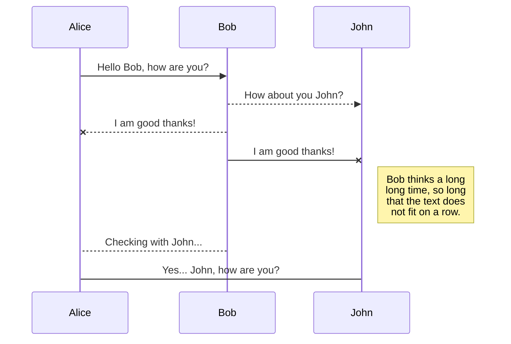

# FxSigExec ZMQ ENDPOINTS
1. **Socket type:** PUB / SUB
1. **Usage:**
    * Subscribes to messages on localhost:5555 or any other port
    * A message format is: `<ServerPubkey> <EncryptedPayload>` where 
	    * `<ServerPubKey>` is a 40 byte Z85 encoded 32-byte pubkey
	    * `<EncryptedPayload>` format is `<Worker> <Command> <Payload>` once decrypted by`<SharedKey>` with AES 256 
		    * `SharedKey` is the 32 byte Diffie Hellman derivated key between`ClientPrivKey` and `ServerPubKey`.
		    * `Worker`: Either account number id or the * char
		    * `Command`: See below
		    * `Payload`: Json for the command

# FxSigExec ZMQ RESPONSES
1. **Socket type:**  PUSH / PULL
1.  **Usage:**
    * Pushes messages on localhost:5557 or any other port
    * A message format is: `<ClientPubKey> <EncryptedPayload>`where
	   * `EncryptedPayload`' format is `<Worker> <Result> <Payload>` once decrypted by `<SharedKey>`with AES 256 
	      * `SharedKey` is the 32 byte Diffie Hellman derivated key between`ServerPrivKey` and `ClientPubKey`. 
	      * `Worker`: Either account number id or the * char
	      * `Result`: "OK" or "Error"
	      * `Payload`: Either a word or json (See each command)

## 

## Commands ###

### Backtest

#### GetPubKey
   
#### Trade

### LotSize

